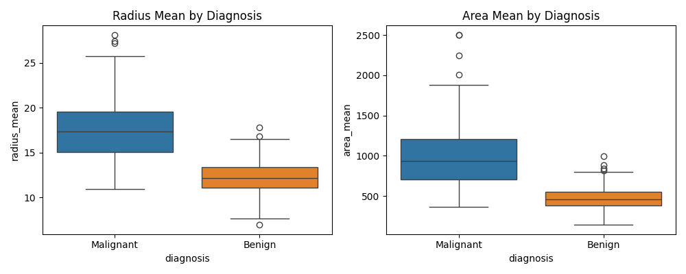
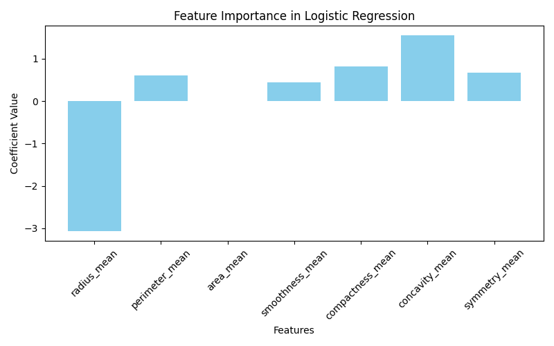
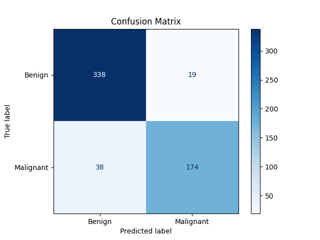
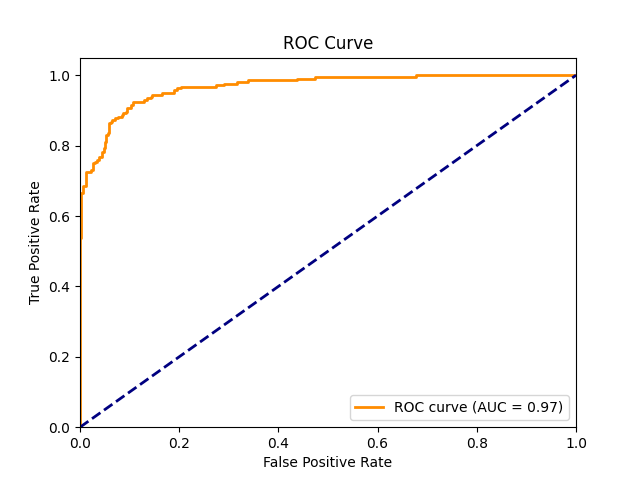

# Breast Cancer Tumor Classification with Logistic Regression

Welcome! This project demonstrates a simple yet effective approach to classifying breast tumors as benign or malignant using logistic regression—a classic algorithm in machine learning. Inspired by my early journey into ML with Python, this project is designed to be approachable for beginners, yet informative for all.

---

## Table of Content

- [Project Overview](#project-overview)
- [Dataset](#dataset)
- [Workflow](#workflow)
- [Results](#results)
- [Visualizations](#visualizations)
- [Setup & Usage](#setup--usage)
- [Tools & Libraries](#tools--libraries)
- [Learning Outcomes](#learning-outcomes)
- [Contributing](#contributing)
- [License](#license)

---

## Project Overview

Using the [IBM Skills Network Cancer Dataset](https://cf-courses-data.s3.us.cloud-object-storage.appdomain.cloud/IBM-BD0231EN-SkillsNetwork/data/cancer.csv), I trained a logistic regression model to predict breast tumor diagnosis. Key features include radius, perimeter, and area. The final model achieves **90% accuracy**.

---

## Dataset

- **Source:** [IBM Skills Network Cancer Dataset](https://cf-courses-data.s3.us.cloud-object-storage.appdomain.cloud/IBM-BD0231EN-SkillsNetwork/data/cancer.csv)
- **Features:** radius_mean, area_mean, perimeter_mean, etc.
- **Target:** Diagnosis (Benign or Malignant)

---

## Workflow

1. **Import Libraries:**  
   - pandas, scikit-learn, seaborn, matplotlib

2. **Data Handling:**  
   - Load the dataset into a DataFrame
   - Data cleaning and preprocessing

3. **Model Building:**  
   - Train logistic regression with `max_iter=200`
   - Fit model using selected features

4. **Evaluation:**  
   - Make predictions, calculate accuracy
   - Analyze precision, recall, F1-score

---

## Results

- **Accuracy:** 90%
- **Classification Report:**
    ```text
    precision    recall  f1-score   support

    Benign       0.90      0.95      0.92       357
    Malignant    0.90      0.82      0.86       212

    accuracy                           0.90       569
    macro avg    0.90      0.88      0.89       569
    weighted avg 0.90      0.90      0.90       569
    ```
- **ROC AUC:** 0.97

---

## Visualizations

1. **Box Plots:**  
   Show how `radius_mean` and `area_mean` differ between classes.  
   

2. **Feature Importance:**  
   Logistic regression coefficients highlight the most influential features.  
   

3. **Confusion Matrix:**  
   Breakdown of predictions.  
   

4. **ROC Curve:**  
   Model’s discriminative ability.  
   

---

## Setup & Usage

1. **Clone the repository:**
    ```bash
    git clone https://github.com/oscurprof/tumor-classification.git
    ```
2. **Install dependencies:**
    ```bash
    pip install pandas scikit-learn matplotlib seaborn
    ```
3. **Open the notebook:**
    - Use Jupyter, VSCode, or PyCharm to open `Classification for Tumors.ipynb`.
4. **Run cells:**
    - Execute each code cell sequentially (Shift+Enter in Jupyter).

---

## Tools & Libraries

- **Python 3.x**
- **pandas** – Data manipulation
- **scikit-learn** – Model building & metrics
- **seaborn, matplotlib** – Visualization

---

## Learning Outcomes

- Data loading and preprocessing with pandas
- Building and evaluating machine learning models
- Visualizing key features and results
- Understanding classification metrics

---

## Contributing

Contributions and suggestions are welcome! Please open an issue or submit a pull request.

---

## License

This project is licensed under the MIT License.

---
